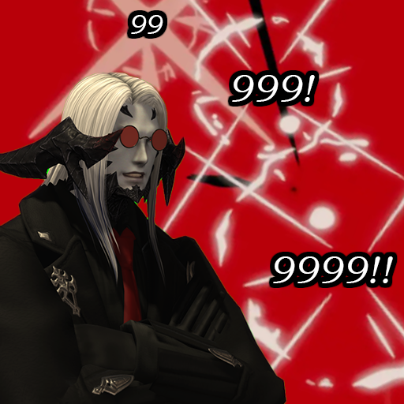

# Damage Terror

<p align="center">
  
</p>

<p align="center">
  <b>Native ImGui damage meter overlay for FFXIV, powered by IINACT.</b><br/>
  No browser. No web server. No extra processes. Just bars ana graphs.
</p>

<p align="center">
  <code>/dt</code> — toggle the damage meter window
</p>

---

## Why Damage Terror?

Most FFXIV damage meters are web overlays running inside an embedded Chromium browser — 200–400 MB of RAM for what amounts to some colored bars. Damage Terror renders directly in the game's ImGui layer with zero browser overhead.

But it isn't just a lighter overlay. It does things no other FFXIV meter does.

---

## Features

### 70+ Metric Columns
51 per-combatant columns and 22 group aggregates (sums, averages, maximums). Includes metrics no other overlay has: Skill Issue (vuln up count), Damage Down, Legs Sweeped, MP Drain/Restore, DPS/HPS Rank, and full group-level statistics.

### DoT/HoT Tick Simulation
ACT lumps DoT damage together or misattributes it. Damage Terror maintains a **potency table of 80+ DoT/HoT status IDs** and distributes tick damage proportionally across active DoTs per caster. It handles ground-effect DoTs (Salted Earth, Doton) via self-buff pre-registration and keeps a 6-second grace window for recently-expired DoTs.

### Built-In Positional Tracking
No need for a separate plugin. Damage Terror integrates a positional lookup table — auto-downloaded and with a static fallback — exposing **Positionals, Positional Hits, Positional Misses, and Positional%** as first-class columns, tooltip fields, and detail metrics. 

### Real-Time Buff/Debuff Uptime
Tracks GainsEffect/LosesEffect log lines in real time with per-status uptime calculation. The Buffs/Debuffs tab shows application history per (target, status, source) — something previously only available on FFLogs after uploading.

### Per-Tab Independent Configuration
Every tab has its own visible columns, header labels, format overrides, value colors, width overrides, tooltip fields, detail panel layout, status bar metrics, and graph line visibility. A "Healing" tab and a "DPS" tab can look completely different.

### Popout Tab Windows
Pop any tab into its own lockable window. DPS bars in one corner, healing tab in another, graph view floating elsewhere — all from one plugin.

### Graphs with Skill Markers
Skill markers on the graph — color-coded by crit, direct hit, crit+DH, DoT tick, and DoT application, each with independent color and size. The standalone graph view overlays all combatants with per-job colors, self-highlighting, legend toggle, and auto-scroll.

### 5-Tab Combatant Detail Panel
Click any combatant bar to expand:
- **Details** — All metrics in collapsible, reorderable sections
- **Skills** — Per-skill breakdown with Physical/Magic color coding and DoT sub-entries
- **Graph** — Individual DPS/HPS/DTPS timeline with skill markers
- **Buffs/Debuffs** — Real-time uptime table with application history
- **Items** — Timestamped item usage with game-data name lookup

### 11 Duty-Type Filters
Independently enable/disable the meter per content type: Overworld, Dungeons, Trials, Raids, Alliance Raids, Deep Dungeons, Field Operations, Field Raids, Criterion, Variant, and PvP.

### Modifier-Key Layout Control
Individual UI elements can appear only when a modifier key combo is held or toggled (Ctrl+Shift, Ctrl+Alt, Shift+Alt, or single modifiers). Minimal HUD during combat, full controls on demand.

### 7 Built-In Themes
One-click themes **loosely** replicating the visual style of **Kagerou, Ember, Horizoverlay, MopiMopi, Ikegami, NextUI**, and a clean Default. Import/export your own.

### Encounter History
Per-encounter graph samples, skill events, damage-taken events, item usage, and status applications are all preserved — not just final numbers. Search, import, export, and manage history with configurable retention.

### Sample Data Simulator
6 presets — from 4-player dungeon to 9999-player stress test — with live combat simulation, skill events, and buff lifecycles. Configure your layout without entering combat.

### Per-Column Format, Color, and Width
Each column can have its own value format (abbreviated/commas/raw), decimal places, K/M thresholds, text color, width, and header label — per tab.

---

## Comparison

| Feature | Web Overlays | LMeter | Damage Terror |
|---|:---:|:---:|:---:|
| Native ImGui (no browser) | — | ✓ | ✓ |
| DoT/HoT potency-weighted attribution | — | — | ✓ |
| Built-in positional tracking | — | — | ✓ |
| Real-time buff/debuff uptime | — | — | ✓ |
| 73 metric columns | ~5–15 | ~10–15 | ✓ |
| Group aggregates (sum/avg/max) | — | — | ✓ |
| Per-tab independent configuration | — | — | ✓ |
| Popout tab windows | — | — | ✓ |
| Graphs with skill markers | — | Basic | ✓ |
| 5-tab combatant detail panel | Basic skills | — | ✓ |
| Duty-type filters (11 types) | — | ✓ | ✓ |
| Modifier-key layout control | — | — | ✓ |
| Encounter import/export | — | — | ✓ |
| Sample data simulator | — | — | ✓ |
| Per-column format/color/width | — | — | ✓ |

---

## Requirements

- [IINACT](https://github.com/marzent/IINACT) (IPC preferred), [ACT](https://advancedcombattracker.com) or any WebSocket source
- [Dalamud](https://goatcorp.github.io/) (API Level 14)

## Installation

Add one of the following custom plugin repositories in Dalamud Settings → Experimental:

**Sea of Terror (recommended and comes with IINACT):**
```
https://raw.githubusercontent.com/MTVirux/SeaOfTerror/master/repo.json
```

**Standalone:**
```
https://raw.githubusercontent.com/MTVirux/DamageTerror/master/repo.json
```

Then search for **Damage Terror** in the plugin installer.

## Commands

| Command | Description |
|---|---|
| `/dt` | Toggle the meter window and all popout windows |
| `/dt config` | Toggle the configuration window |
| `/dt toggle <group>` | Toggle visibility of all popout windows in a tab group |
